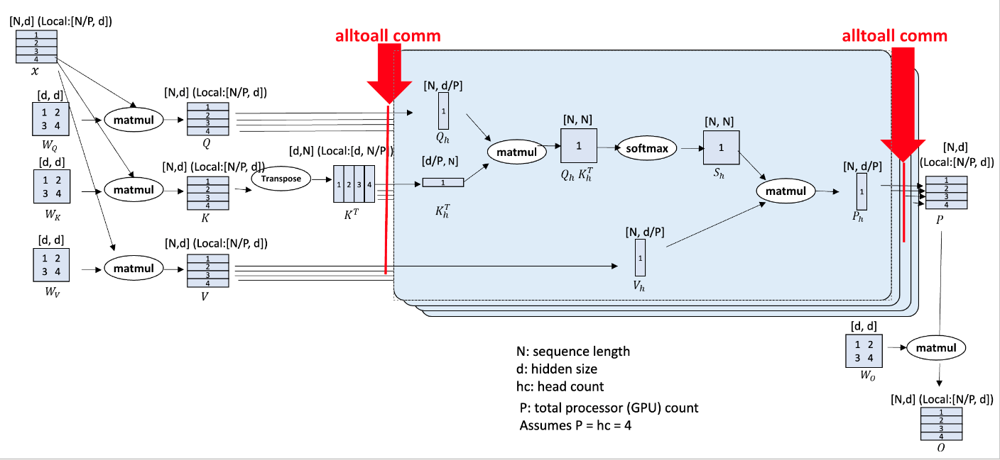
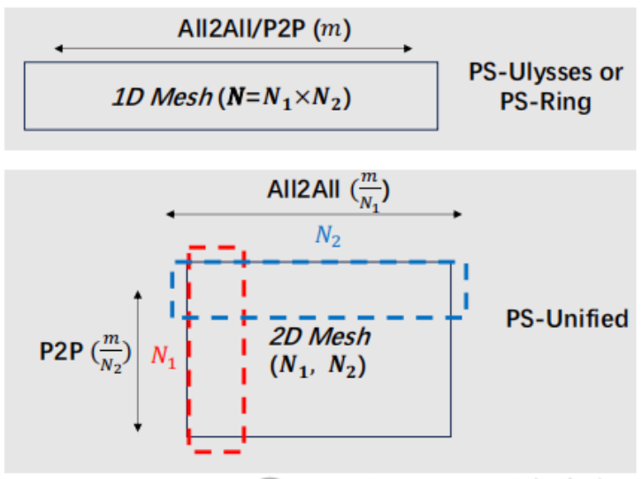

# Parallelism
## DP
## TP
## PP
## Zero优化
## Sequence Parallelism

### DeepSpeed-Ulysses（SP-Ulysses）

https://github.com/deepspeedai/DeepSpeed/blob/master/blogs/deepspeed-ulysses/README.md
SP并行度受到注意力头数的限制

### Ring-Attention（SP-Ulysses）

矩阵乘法的细分而降低了计算效率

### SP优化

- [USP: A Unified Sequence Parallelism Approach for Long Context Generative AI](https://arxiv.org/abs/2405.07719)

